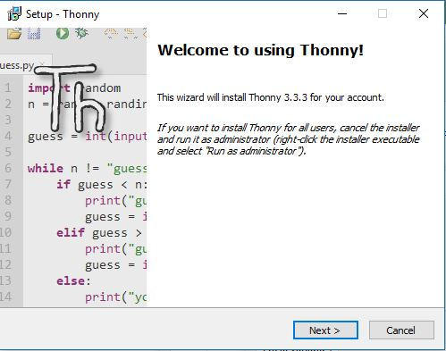
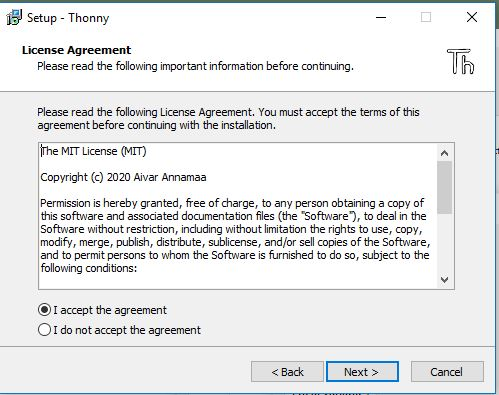

卓远和雅瑜小朋友，你们的寒假编程兴趣班开课啦！这本书是专门为你们编写的，希望你们能够学得开心!

第一步要先在你们的电脑上安装能够创作游戏和动画的武器-->编程环境, 在上面你们可以编写电脑看得懂的语言，这样就可以指挥电脑干活啦！

# 1. 安装编程环境

- 访问网站: [https://thonny.org/](https://thonny.org/)

  

  - 点击 "Windows", 确定运行

- 安装程序
  - 打开安装程序点击 "Next"(下一步)
    
    
    
  - 选择"Create desktop icon"(创建桌面图标), 继续"Next"
    

- 双击桌面新安装的Thonny程序

  

- 安装pygame
  - 点击菜单"工具", 选择第一个子菜单"管理器"

    

  - 出现包管理器界面

    

  - 搜索"pygame"

    

  - 从Search results(搜索结果)中点击"pygame"

    

  - 安装完成如下,点击"关闭"即可

    

# 2. 体验python语言的魔法

- 第一个游戏程序: 碰撞气球
  - 参考[https://www.pygame.org/docs/tut/PygameIntro.html](https://www.pygame.org/docs/tut/PygameIntro.html)
  - 右键保存，下载气球图标到桌面

    

  - 拷贝气球左边的代码到Thonny文本区，保存文件到桌面，可以取文件名为ball.py
    ```python
    import sys, pygame, time
    pygame.init()

    size = width, height = 320, 240
    speed = [2, 2]
    black = 0, 0, 0

    screen = pygame.display.set_mode(size)

    ball = pygame.image.load("intro_ball.gif")
    ballrect = ball.get_rect()

    while 1:
        for event in pygame.event.get():
            if event.type == pygame.QUIT: sys.exit()

        ballrect = ballrect.move(speed)
        if ballrect.left < 0 or ballrect.right > width:
            speed[0] = -speed[0]
        if ballrect.top < 0 or ballrect.bottom > height:
            speed[1] = -speed[1]

        screen.fill(black)
        screen.blit(ball, ballrect)
        pygame.display.flip()
        time.sleep(0.01)
    ```
  - 点击运行，就可以看到碰撞的气球啦
- 试试电脑里面自带的游戏
  - 访问[pygame](https://www.pygame.org/docs/ref/examples.html)
  - 试玩外星人游戏
    ```python
    import pygame.examples.aliens
    pygame.examples.aliens.main()
    ```

- 认识Turtle(小乌龟)画图
  - 让电脑来[画画](https://www.geeksforgeeks.org/y-fractal-tree-in-python-using-turtle/) 

    

    ```
    from turtle import *

    speed('fastest') 

    # turning the turtle to face upwards 
    rt(-90) 

    # the acute angle between 
    # the base and branch of the Y 
    angle = 30

    # function to plot a Y 
    def y(sz, level): 

      if level > 0: 
        colormode(255) 
        
        # splitting the rgb range for green 
        # into equal intervals for each level 
        # setting the colour according 
        # to the current level 
        pencolor(0, 255//level, 0) 
        
        # drawing the base 
        fd(sz) 

        rt(angle) 

        # recursive call for 
        # the right subtree 
        y(0.8 * sz, level-1) 
        
        pencolor(0, 255//level, 0) 
        
        lt( 2 * angle ) 

        # recursive call for 
        # the left subtree 
        y(0.8 * sz, level-1) 
        
        pencolor(0, 255//level, 0) 
        
        rt(angle) 
        fd(-sz) 
        
        
    # tree of size 80 and level 7 
    y(80, 7) 
    ```

  - 画圈的小乌龟
    ```python
    import turtle

    def draw_circle(turtle, color, size, x, y):
        turtle.penup()
        turtle.color(color)
        turtle.fillcolor(color)
        turtle.goto(x,y)
        turtle.begin_fill()
        turtle.pendown()
        turtle.circle(size)
        turtle.penup()
        turtle.end_fill()
        turtle.pendown()

    tommy = turtle.Turtle()
    tommy.shape("turtle")
    tommy.speed(500)

    draw_circle(tommy, "green", 50, 25, 0)
    draw_circle(tommy, "blue", 50, 0, 0)
    draw_circle(tommy, "yellow", 50, -25, 0)

    tommy.penup()
    tommy.goto(0,-50)
    tommy.color('black')
    tommy.write("Let's Learn Python!", align="center", font=(None, 16, "bold"))
    tommy.goto(0,-80)
    ```
